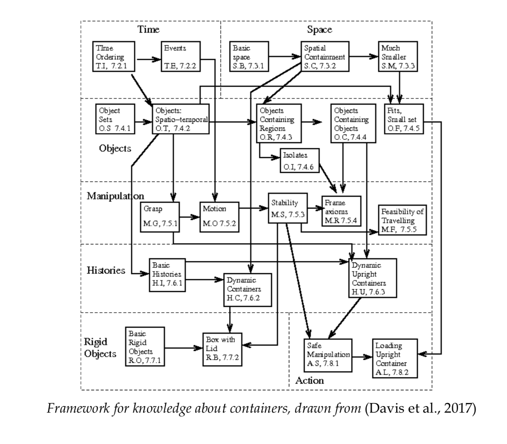

# The next decade in AI
## Defintions

*Robust AI* : Intelligence that, while no necessarly superhuman or self-improving (AGI), can be counted on to apply what it knows to a wide range of problems in a **systematic** and **reliable** way, synthezising knowledge fro; a variety of sources such that it can reason **flexibly** and **dynamically** about the world, **transferring** what it learns in one context to another, in a way that we would expect of an ordinary adult.

*Narrow AI*: Systems that perform a single narrow goal extremelly well but often in ways that are extremely centered aruond a single task and not robust and **transferable** to even modestly different circumstances without extensive retraining. 

*Degrees of Learning*: The different tools available to a system to input/infuse/induce knowledge (aka learn)

*Idiosyncrasy*: Systems that lack solid ways of generalizing beyond a space of training examples cannot be trustted in open-ended domains. If you think of each individual systems as a function approximator, currently popular systems tend to be great at memorized examples, and good at many (though not all) examples near the training exeamples - which makes them useful for many applications revolving around classfication. But they are poor when pushed beyond training distribution.

NS-CL : Neuro-Symbolic Concept Learner

*knowledge representation*: Field that aims to accumulate and represent abstract knowledge.

*Nativism*: The idea that some "knowledge" is innate. (not learned but there at the beginning)
## Thoughts

### 1

- what are the real differences between a **robust** and **AGI**
- is robust AI necessarly a stepway to AGI
- "If we cannot count on our AIto behave reliably, we should no trust it"
  - To what extent is that true?
  - compare this statemtn to the definition of a robust AI

- AI are often compared to human when talking about robustness but there are many limits on this reflection: 
  - in terms of tools at our disposal to explore with have 3d vision, memory, the ability to ask questions to focus our understanding, etc 
    - Make an analogy of the limits of degrees of learning a modern AI has compared to a human.

    - It is like putting a child with no sense of depth in a dark room where the only thing he sees is a screen with images of dogs and not dogs, and then expecting him to be robust.
    - It is like teaching a child by only trying to transmit electric signal directly to the brain as an only way of degrees of learnings

- Pythagorus or the curse of intelligence (being too intelligent to see simple relationships) (Do a little comic a of genius in front of a reflection that creates a whole theory about that it must be aclone from another universe with a power shield in front of it etc etc)
    - Make an AI that learns rules of a system
    - Break down the minimal requirements nodes necessary for breaking a system, via it's logic
        - If it is not enough, he adds another logic node, and tries to find the rule behind the scheme 
        - For example, have an AI that start with one logic node and it tries values to see if it is enough to satisfy the rule
        - repeat until enough logic nodes are added to be able to find a combination that solves the identity

Thoughs on Idiocrary and Excessive dependncy on exact details of training regime
- Models suffer the curse of conspiracy, too smart to see simple relationships or identities

### 2.1 Hybrid Architecture

- "In particular, four basic ideads undergrid virtually every compute program: 
          - Variables (x and y)
          - Instances (specific numbers)
          - Bindings that tie variables to instances (connecting a variable to an instance)
          - Operations over variables (addition or multiplication)"

Are those the minimal knowledge pieces that a computer should build? (Could also include loops and control structures, comparisons, )
Machine Learning systems typically lean to approximate functions relating input to output (like curve fitting), programmers typically *define* their algorithms independently of training data, in terms of operations over variables.

- Implementing Neural networks that are compatible with symbol manipulation (*Implementational connectionism*)
- Implementing NN that operate without owing anything to the principles of symbol-manipulation (*Eliminative connectionism*)
Maybe make a set of problems that are heavily dependent on *implementational connectionism* (Identity finding) and others that are heavily dependent on *Eliminative connectionism* (image processing CNN, multi variable problems).
"Foundational work on neurosymbolic models is **D'Avila Garcez, Lamb, & Gabbay, 2009)**.

- "What it lacks is a satisfactory framework for learning."
  - Right about what would be needed, recommanded or unknown to develop this framework.

## 2.2 Large-scale knowledge, some which is abstract and causal

- Comments on GPT-2 are valid. Can it still be compared to how a small child would use words?
  - "**If you paint an airplane so that it looks like a dragon, it will be** *a dragon*."
  - Seems like how a child would complete the sentence.

- The comparison with Nigel Richards with the french scrabble tournament could also be made parallel with reinforcement learning which would beat the best players in the world in scrabbles without knowing how to use the language.

- "One problem with trying to build a system out of parts with such little realiability is that downstream will inevitably suffer. The whole point of knowledge is to use it in action and interpretation and decision-making."
  - Comments? 

- **Systematic ways to induce, represent, and manipulate large databases of structured, abstract knowledge, often in causal nature, are a prerequisite to robust intelligence.**

- Do we need fundamental axioms of knowledge? 
  - Do they need to be hardcoded or can they be learnt?
  - Should an AI that build knowledge need to start from the bottom up, by first understading the axiom rules and after only learn about cats and wikipedia?
  - Are there any research made on human brains about the large and necessary presence of axioms in the brain, needed and essential to the build up of semi complex knowledge

If the comparison is made between human and AIs, the basis of the framework can be "colored" by how the human access this knowledge and how AI lack the "degrees of learning".
    - Make a large comparison between AI and humans? (with the angle of the degrees of learning?)

- Have a discussion about innate knowledge. AIs are better if they are tuned primarly with a sens of innate knowledge/strategy, but that comes with the backslash that they have a harder time to generalize and they also seem less in capacity to learn (why couldn't they learn this native knowledge?). (give the example of my robot playing **2048**)
  - *The real question for AI should be not, **how small can we make our library of priors?**, but **what set of priors could most effectively set the stage for learning?**.*

- Arguemnt (page 33) about the genome and their expression in the development of the brain.
  - Yes the genome have to express a form of prior knowledge, helping the structuration of the brain. Not everything can be left to randomness.
  - But could this also be a reason of limitations in the development of human intelligence?
  - What is a good ratio of innate knowledge, versus generalization ability?

p. 36
    Discuss the final claim of this part about fundamental bricks of innate knowdege (space/time) and the fight that we shouldn't learn everything from scratch everytime.